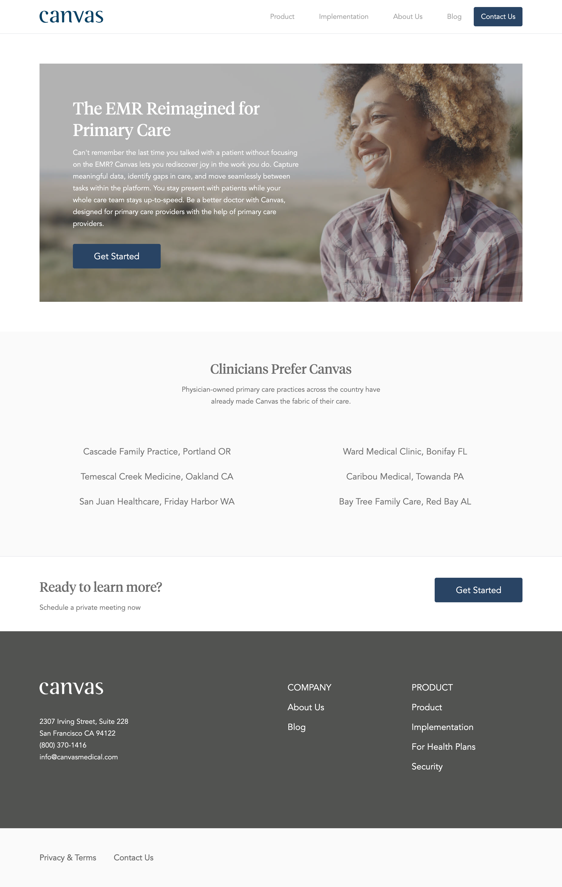

# css-canvas-medical

Using HTML and CSS to build a web page from scratch.

### Before You Begin

Be sure to check out a new branch (**from master**) for this exercise. Detailed instructions can be found [**here**](../../guides/before-each-exercise.md).

### Challenge

For this challenge, you will be using HTML and CSS to build a custom web page from scratch. Your implementation doesn't have to look absolutely identical to the reference image, but get as close as you can. It should be challenging to notice any differences. Some fonts and starter code have been included to help you begin.

Complete `index.html` and `styles.css` to create a page that looks as close to the following example as possible. You should not need to modify any of the other files.

  

### Workflow

It is recommended that you build your implementation side-by-side with the reference image. Use your browser's developer tools to inspect elements and experiment with styles as you go.

Work on the web page section-by-section and make a commit as you complete each section.

### Submitting Your Solution

When your solution is complete, change directories to the root of your lessons repository. Then commit your changes, push, and submit a Pull Request on GitHub. Detailed instructions can be found [**here**](../../guides/after-each-exercise.md).

### Continued Build Out

Once you have completed the home page you are ready to tackle the rest of the pages for our website.  Checkout the instructions [here](readme-continued.md).
