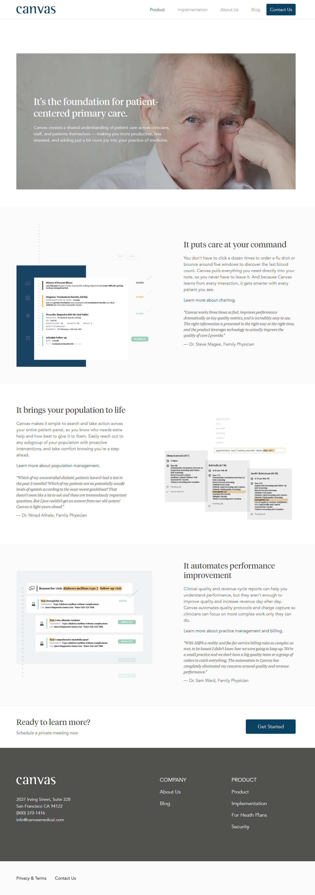
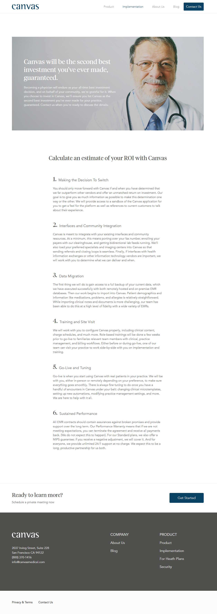
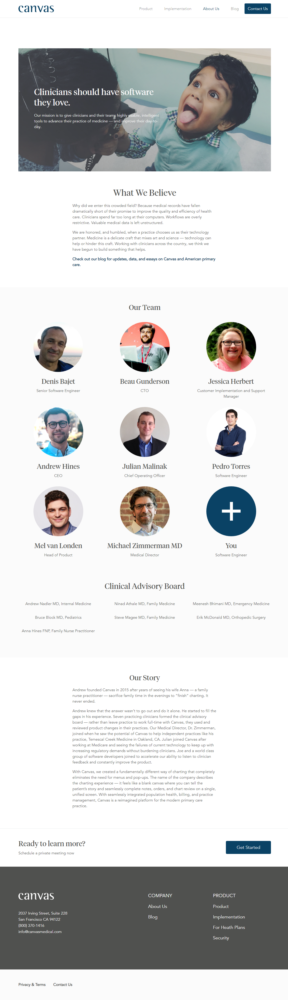
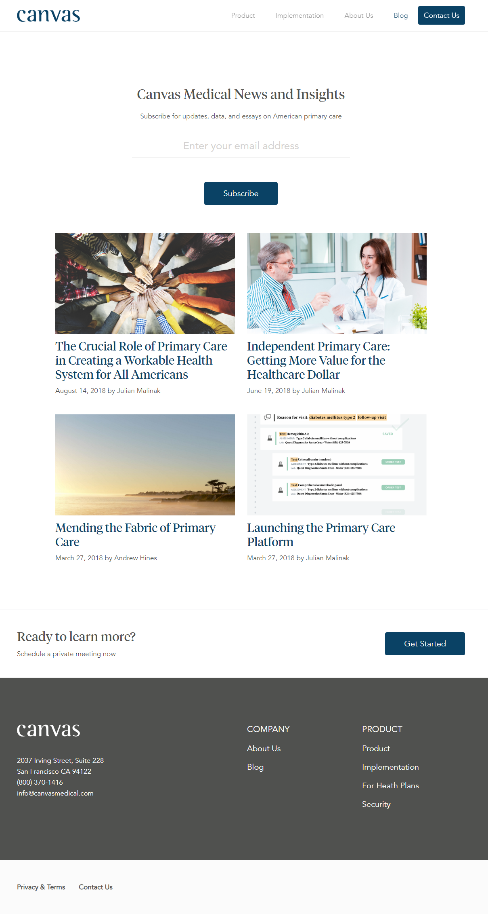
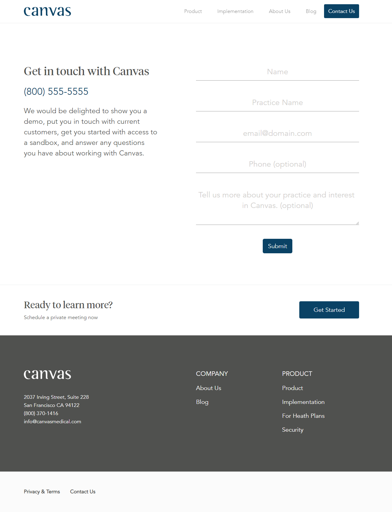

### css-canvas-medical-continued

Now that you have completed the home page for Canvas Medical, you are now able to take on the rest of the pages.

All of the assets for each page are in the images directory in this file.

### Before You Begin

Be sure to check out a new branch (**from css-canvas-medical**) for each page that you work on.  Remember to commit and push frequently since there is a lot of work to be done.

### Challenges

### Product

  

### Implementation

  

### About Us

  

### Blog

  

### Contact Us

  

### Workflow

It is recommended that you build your implementation side-by-side with the reference image. Use your browser's developer tools to inspect elements and experiment with styles as you go.

Work on the web page section-by-section and make a commit as you complete each section.

### Submitting Your Solution

When your solution is complete, change directories to the root of your lessons repository. Then commit your changes, push, and submit a Pull Request on GitHub. Detailed instructions can be found [**here**](../../guides/after-each-exercise.md).
